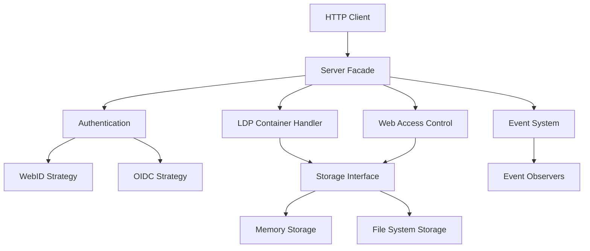
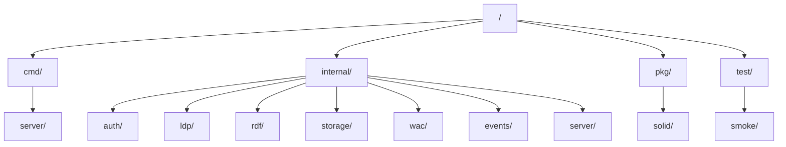
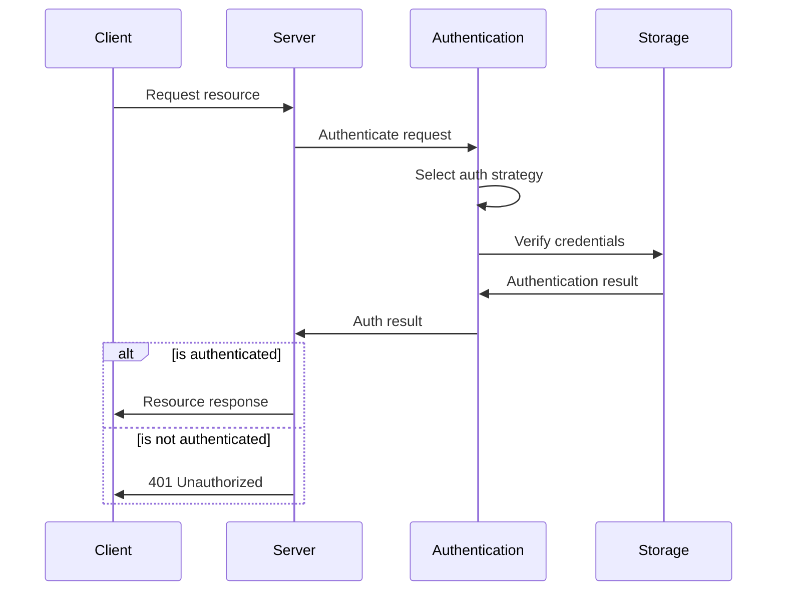
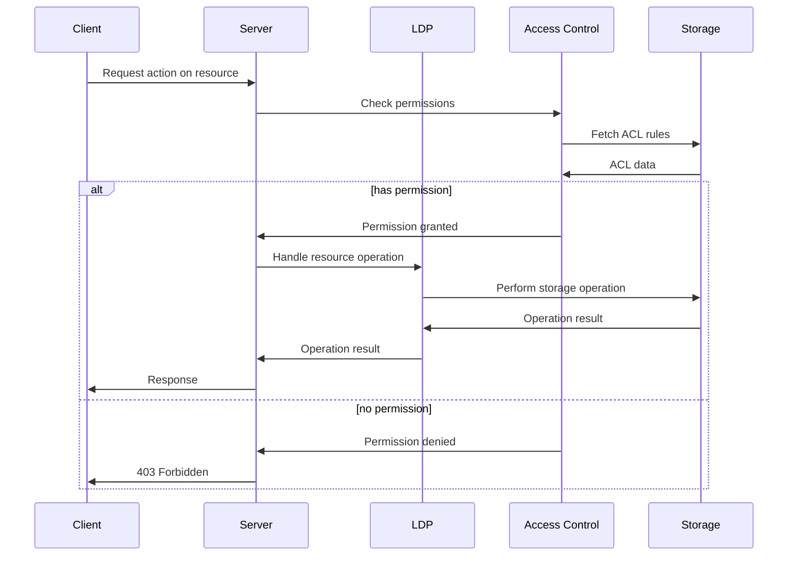

# SolidGo - A Solid Protocol Server in Go

SolidGo is a high-performance implementation of the [Solid Protocol](https://solidproject.org/TR/protocol) using Go 1.24 and its standard library. This server provides a way to store and manage linked data with robust authentication and access control.

## Architecture

The server follows these design patterns:
- **Facade Pattern**: Simplifies the server API through a unified interface
- **Strategy Pattern**: For pluggable authentication methods, storage backends, and query handling
- **Factory Method**: Creates different types of Solid resources
- **Observer Pattern**: Handles events in the Solid server

### High-Level Components



### Directory Structure



## Key Features

- Complete Solid Protocol implementation
- Standard library only - no external dependencies
- WebID and OIDC authentication support
- Web Access Control (WAC) for fine-grained access control
- Linked Data Platform (LDP) container management
- RDF parsing and serialization
- Event system for real-time updates
- Modular design with clean interfaces
- Containerized deployment with Docker

## Running Locally

```bash
# Build and run locally
go run cmd/server/main.go

# Run tests
go test ./...

# Run with Docker
docker-compose up -d
```

## API Endpoints

The server implements the standard Solid Protocol endpoints:

- `GET /`: Server information
- `GET /{container}/`: List resources in a container
- `POST /{container}/`: Create a new resource
- `GET /{resource}`: Get a resource
- `PUT /{resource}`: Create or update a resource
- `PATCH /{resource}`: Update a resource
- `DELETE /{resource}`: Delete a resource
- `HEAD /{resource}`: Get resource metadata
- `OPTIONS /{resource}`: Get resource options

## Authentication Flow



## Resource Management Flow



## License

APACHE-2