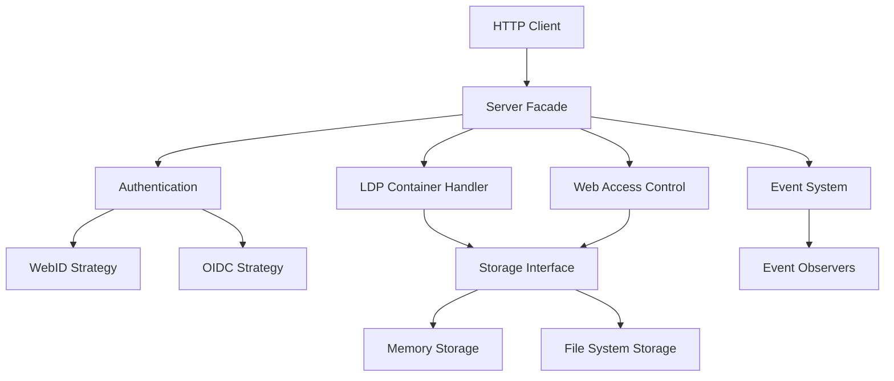
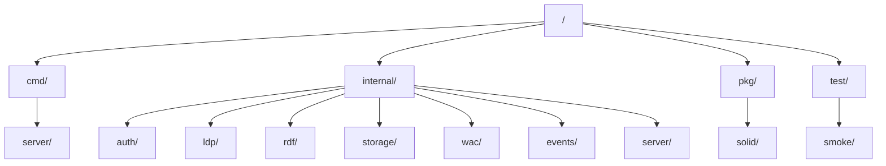
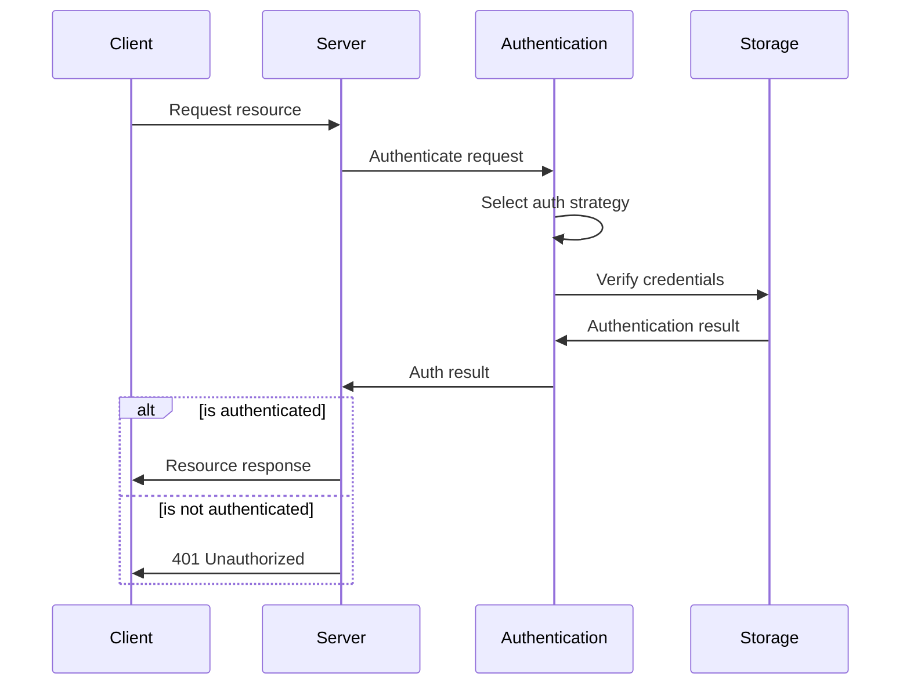
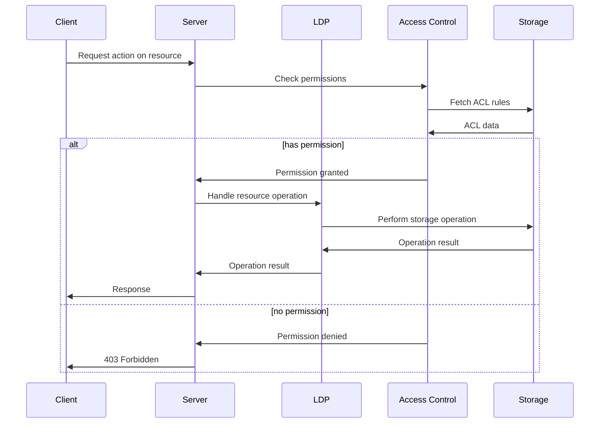

# SolidGo - A Solid Protocol Server in Go

SolidGo is a high-performance implementation of the [Solid Protocol](https://solidproject.org/TR/protocol) using Go 1.24 and its standard library. This server provides a way to store and manage linked data with robust authentication and access control.

## Architecture

The server follows these design patterns:
- **Facade Pattern**: Simplifies the server API through a unified interface
- **Strategy Pattern**: For pluggable authentication methods, storage backends, and query handling
- **Factory Method**: Creates different types of Solid resources
- **Observer Pattern**: Handles events in the Solid server

### High-Level Components



### Directory Structure



## Key Features

- Complete Solid Protocol implementation
- Standard library only - no external dependencies
- WebID and OIDC authentication support
- Web Access Control (WAC) for fine-grained access control
- Linked Data Platform (LDP) container management
- RDF parsing and serialization
- Event system for real-time updates
- Modular design with clean interfaces
- Containerized deployment with Docker

## MCP and Solid: Protocol Comparison

### What is MCP?

The Model Context Protocol (MCP) is a modern, open protocol designed to standardize how AI applications (especially LLMs) interact with external tools, data sources, and resources. MCP is resource-centric, using JSON-RPC for communication, and is primarily focused on enabling AI models to access and manipulate context and tools in a standardized way. It is gaining traction in the AI ecosystem, especially for agentic and plugin-based integrations.

**Key MCP Features:**
- Resource-based architecture (URI-addressable resources)
- JSON-based, stateful communication (often over stdio or HTTP/SSE)
- Standardized discovery of tools and resources
- Focus on model-to-server and client-to-server extensibility
- Designed for AI agent and LLM integration

### Solid vs MCP: A Comparison

| Feature                | Solid Protocol                                   | MCP (Model Context Protocol)                |
|-----------------------|--------------------------------------------------|---------------------------------------------|
| **Primary Domain**    | Decentralized Web, Linked Data, Personal Data    | AI/LLM integration, agentic systems         |
| **Data Model**        | RDF, Linked Data, URIs, semantic web standards   | JSON-RPC, resource-centric, custom schemas  |
| **Authentication**    | WebID, OIDC, WAC, fine-grained access control    | OAuth (draft), custom, less standardized    |
| **Extensibility**     | Modular, pluggable storage/auth, open standards  | Pluggable tools/resources, protocol-focused |
| **Interoperability**  | Web-wide, cross-platform, semantic compatibility | AI/LLM ecosystem, tool/plugin compatibility |
| **Focus**             | User data ownership, interoperability, privacy   | Model context, tool invocation, orchestration|
| **Transport**         | HTTP(S), RESTful, LDP, SPARQL, etc.              | JSON-RPC over stdio, HTTP, SSE              |
| **Linked Data**       | Core principle (RDF, URIs, vocabularies)         | Not a core principle                        |

### Why Solid is a Better Protocol for Data and Interoperability

While MCP is a promising protocol for connecting AI models to tools and resources, Solid stands out as a superior protocol for data interoperability, ownership, and the open web. Here’s why:

- **Rich Data Models:** Solid is built on the W3C’s RDF and Linked Data Platform (LDP) standards, enabling data to be described, linked, and queried in a universally interoperable way. This allows for deep semantic interoperability across applications, organizations, and domains.
- **Linked Data by Design:** Solid’s use of URIs and RDF means that data is inherently linkable, discoverable, and reusable. This is essential for building a truly open, decentralized web of data, where information can be connected and understood across silos.
- **Fine-Grained Access Control:** Solid incorporates robust access control mechanisms (Web Access Control, OIDC, WebID), allowing users to control who can access their data at a granular level. MCP’s authentication is less mature and less standardized.
- **User-Centric and Decentralized:** Solid is designed for user data ownership and privacy, empowering individuals to control their own data and share it as they choose. MCP is more model- and tool-centric, focusing on AI agent workflows rather than user empowerment.
- **Web-Scale Interoperability:** Solid’s protocols are designed for the web, using HTTP, URIs, and semantic vocabularies, making it natively compatible with existing web infrastructure and standards.
- **Efficient Semantic Search and Context Sharing:** Solid’s use of RDF enables powerful semantic search capabilities, allowing data to be queried and discovered based on meaning rather than just structure. This makes sharing and reusing context across applications and domains far more efficient than with traditional JSON-based approaches, where semantic relationships are not explicit. Furthermore, RDF’s graph-based model is inherently scalable for large, distributed datasets—enabling high-throughput querying and integration across diverse sources, which is challenging to achieve with hierarchical, document-centric JSON.

### When to Use Each
- **Use MCP** when building AI/LLM-powered applications that need to dynamically discover and invoke tools, or when integrating with agentic systems and plugins.
- **Use Solid** when you need robust, interoperable, and user-centric data storage, sharing, and access control—especially for web, personal data, and linked data use cases.

**In summary:**
Solid is the protocol of choice for open, linked, and user-controlled data on the web, while MCP is a strong emerging standard for AI agent and tool orchestration. For applications where data interoperability, semantic richness, and user empowerment are critical, Solid’s foundation in linked data and web standards makes it the superior protocol.

## Running Locally

```bash
# Build and run locally
go run cmd/server/main.go

# Run tests
go test ./...

# Run with Docker
docker-compose up -d
```

## API Endpoints

The server implements the standard Solid Protocol endpoints:

- `GET /`: Server information
- `GET /{container}/`: List resources in a container
- `POST /{container}/`: Create a new resource
- `GET /{resource}`: Get a resource
- `PUT /{resource}`: Create or update a resource
- `PATCH /{resource}`: Update a resource
- `DELETE /{resource}`: Delete a resource
- `HEAD /{resource}`: Get resource metadata
- `OPTIONS /{resource}`: Get resource options

## Authentication Flow



## Resource Management Flow



## Steps

1. Re-create community version []
2. Debug, make sure works locally.

## AUTHOR

https://www.linkedin.com/in/michaelholborn/ - Michael.

## License

APACHE-2
