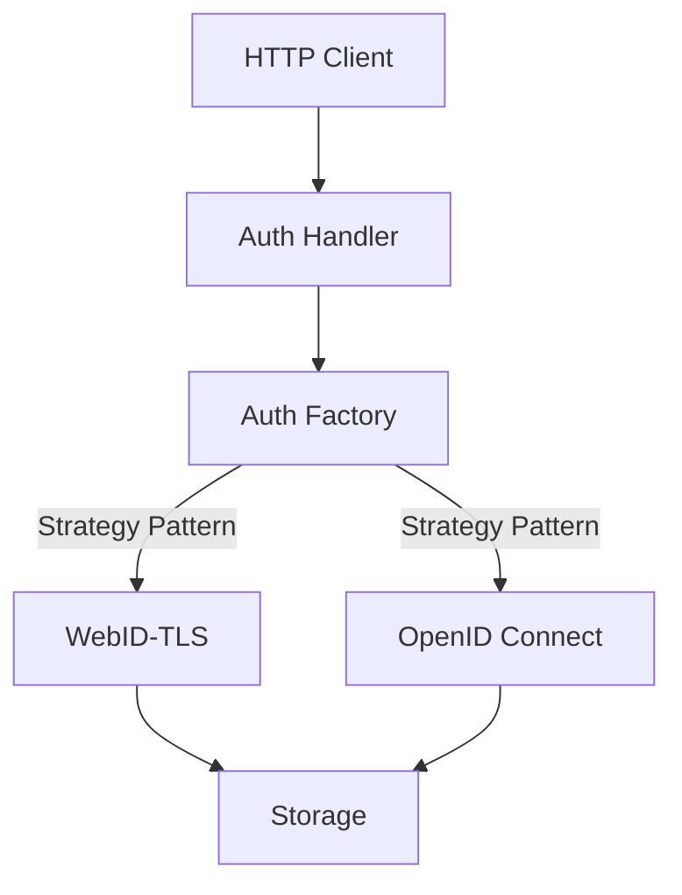

# Auth Package

This package implements authentication for the Solid server, using the Strategy pattern to allow different authentication methods.

## Design



## Key Components

- **AuthStrategy**: Interface for different authentication strategies
- **Factory**: Factory for creating authentication strategies
- **Handler**: HTTP handler for authentication
- **WebIDAuth**: WebID-TLS authentication strategy
- **OIDCAuth**: OpenID Connect authentication strategy

## Authentication Strategies

The following authentication strategies are supported:

- **WebID-TLS**: Authentication using WebID and TLS client certificates
- **OIDC**: Authentication using OpenID Connect (Solid-OIDC)

## Agent Representation

Authenticated agents are represented by the `Agent` type, which includes:

- **ID**: The WebID URI of the agent
- **Name**: The display name of the agent
- **Email**: The email address of the agent (if available)
- **IsAuthenticated**: Whether the agent is authenticated
- **Type**: The type of the agent (User, Application, etc.)

## Usage

```go
// Create an authentication factory
factory := auth.NewFactory()

// Create an authentication handler
handler, err := auth.NewHandler(factory, storageFactory)
if err != nil {
    log.Fatalf("Failed to create authentication handler: %v", err)
}

// Authenticate a request
agent, err := handler.Authenticate(request)
if err != nil {
    // Authentication failed
    http.Error(w, "Authentication failed", http.StatusUnauthorized)
    return
}

// Check if agent is authenticated
if !agent.IsAuthenticated {
    // Authentication failed
    http.Error(w, "Authentication required", http.StatusUnauthorized)
    return
}

// Use agent for authorization
fmt.Printf("Authenticated agent: %s\n", agent.ID)
``` 