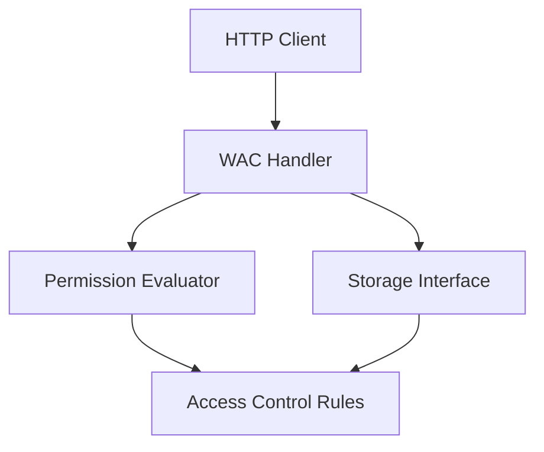

# WAC Package

This package implements Web Access Control (WAC) for the Solid server. It provides functionality for managing access control rules and checking permissions.

## Design



## Key Components

- **Handler**: HTTP handler for WAC operations
- **Evaluator**: Evaluates access control rules
- **Storage**: Interface for storing access control rules
- **Rule**: Represents an access control rule
- **Permission**: Represents a permission (Read, Write, Append, Control)

## Access Control Rules

The package supports the following access control rules:

- **Agent**: Access control rule for a specific agent
- **Group**: Access control rule for a group of agents
- **Public**: Access control rule for public access
- **Origin**: Access control rule for a specific origin
- **Default**: Default access control rule

## Usage

```go
// Create a WAC handler
handler := wac.NewHandler(storageFactory)

// Handle WAC operations
err := handler.HandleRequest(w, r)
if err != nil {
    // Handle error
    http.Error(w, err.Error(), http.StatusInternalServerError)
    return
}

// Check permissions
permissions, err := handler.GetPermissions(agent, resource)
if err != nil {
    // Handle error
    return
}

// Check if agent has permission
if !permissions.Has(wac.Read) {
    // Permission denied
    http.Error(w, "Permission denied", http.StatusForbidden)
    return
}
```

## WAC Operations

The package supports the following WAC operations:

- **GetPermissions**: Get permissions for an agent on a resource
- **SetPermissions**: Set permissions for an agent on a resource
- **DeletePermissions**: Delete permissions for an agent on a resource
- **ListPermissions**: List permissions for a resource
- **CheckPermission**: Check if an agent has a permission on a resource

## Permission Types

The package supports the following permission types:

- **Read**: Permission to read a resource
- **Write**: Permission to write a resource
- **Append**: Permission to append to a resource
- **Control**: Permission to control a resource

## Access Control Rules

The package supports the following access control rules:

- **Agent**: Access control rule for a specific agent
- **Group**: Access control rule for a group of agents
- **Public**: Access control rule for public access
- **Origin**: Access control rule for a specific origin
- **Default**: Default access control rule

## Error Handling

The package defines the following error types:

- **ErrNotFound**: Access control rule not found
- **ErrExists**: Access control rule already exists
- **ErrInvalid**: Invalid access control rule
- **ErrPermission**: Permission denied
- **ErrStorage**: Storage error 