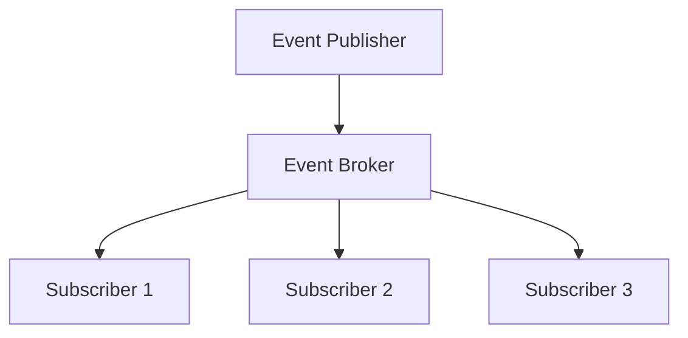

# Events Package

This package implements an event system for the Solid server. It provides functionality for publishing and subscribing to events.

## Design



## Key Components

- **Publisher**: Publishes events to the event broker
- **Subscriber**: Subscribes to events from the event broker
- **Broker**: Manages event subscriptions and routing
- **Event**: Represents an event
- **Subscription**: Represents a subscription to events

## Event Types

The package supports the following event types:

- **ResourceCreated**: Event when a resource is created
- **ResourceUpdated**: Event when a resource is updated
- **ResourceDeleted**: Event when a resource is deleted
- **ContainerCreated**: Event when a container is created
- **ContainerDeleted**: Event when a container is deleted
- **PermissionChanged**: Event when permissions are changed
- **AgentAuthenticated**: Event when an agent is authenticated
- **AgentDeauthenticated**: Event when an agent is deauthenticated

## Usage

```go
// Create an event broker
broker := events.NewBroker()

// Create a publisher
publisher := events.NewPublisher(broker)

// Create a subscriber
subscriber := events.NewSubscriber(broker)

// Subscribe to events
subscription, err := subscriber.Subscribe(events.ResourceCreated)
if err != nil {
    // Handle error
    return
}

// Publish an event
event := &events.Event{
    Type: events.ResourceCreated,
    Resource: "https://example.org/resource",
    Agent: "https://example.org/agent#me",
}
err = publisher.Publish(event)
if err != nil {
    // Handle error
    return
}

// Receive events
for {
    event, err := subscription.Receive()
    if err != nil {
        // Handle error
        return
    }
    // Handle event
    fmt.Printf("Event: %v\n", event)
}
```

## Event Operations

The package supports the following event operations:

- **Publish**: Publish an event
- **Subscribe**: Subscribe to events
- **Unsubscribe**: Unsubscribe from events
- **Receive**: Receive events
- **Close**: Close a subscription

## Event Properties

The package supports the following event properties:

- **Type**: Event type
- **Resource**: Resource identifier
- **Agent**: Agent identifier
- **Time**: Event time
- **Data**: Event data

## Error Handling

The package defines the following error types:

- **ErrClosed**: Subscription is closed
- **ErrTimeout**: Receive timeout
- **ErrInvalid**: Invalid event
- **ErrStorage**: Storage error 