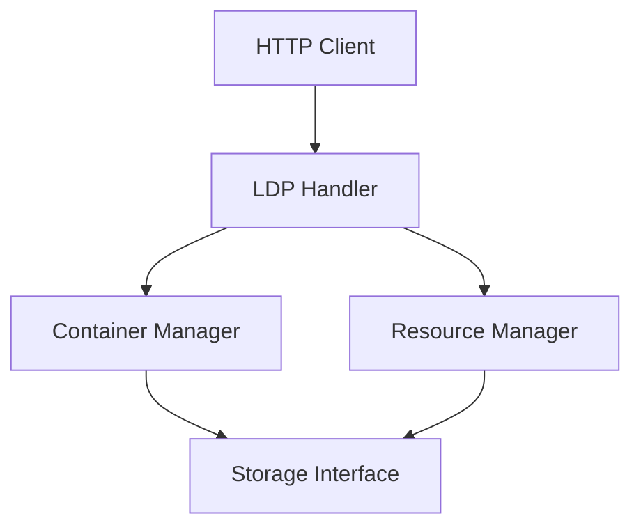

# LDP Package

This package implements the Linked Data Platform (LDP) specification for the Solid server. It provides functionality for managing LDP containers and resources.

## Design



## Key Components

- **Handler**: HTTP handler for LDP operations
- **ContainerManager**: Manages LDP containers and their contents
- **ResourceManager**: Manages LDP resources
- **Storage**: Interface for persistent storage of LDP resources

## LDP Resource Types

The package supports the following LDP resource types:

- **BasicContainer**: A container that can contain other resources
- **DirectContainer**: A container that can contain other resources and has additional metadata
- **IndirectContainer**: A container that can contain other resources and has membership triples
- **NonRDFSource**: A resource that is not an RDF document
- **RDFSource**: A resource that is an RDF document

## Usage

```go
// Create an LDP handler
handler := ldp.NewHandler(storageFactory)

// Handle LDP operations
err := handler.HandleRequest(w, r)
if err != nil {
    // Handle error
    http.Error(w, err.Error(), http.StatusInternalServerError)
    return
}
```

## LDP Operations

The package supports the following LDP operations:

- **GET**: Retrieve a resource
- **POST**: Create a new resource in a container
- **PUT**: Create or update a resource
- **PATCH**: Update a resource
- **DELETE**: Delete a resource
- **HEAD**: Get resource metadata
- **OPTIONS**: Get resource options

## Container Management

Containers can be created and managed using the following operations:

- **CreateContainer**: Create a new container
- **DeleteContainer**: Delete a container
- **ListContainer**: List the contents of a container
- **GetContainer**: Get container metadata

## Resource Management

Resources can be created and managed using the following operations:

- **CreateResource**: Create a new resource
- **DeleteResource**: Delete a resource
- **GetResource**: Get a resource
- **UpdateResource**: Update a resource
- **PatchResource**: Patch a resource 