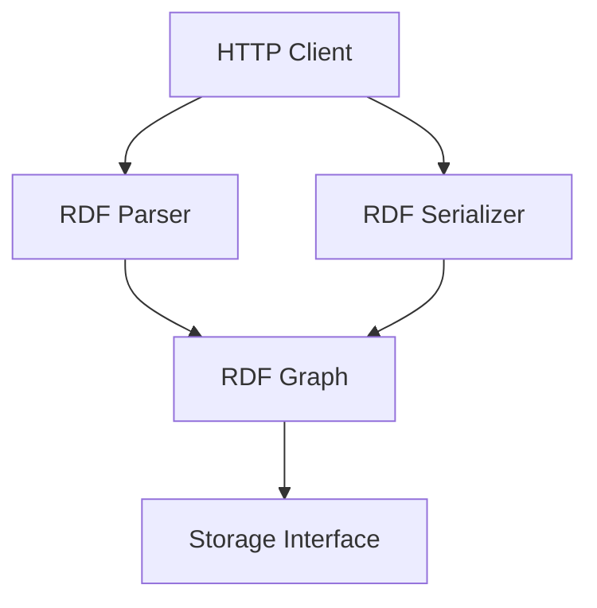

# RDF Package

This package provides RDF parsing, serialization, and manipulation functionality for the Solid server. It implements the RDF 1.1 specification and supports various RDF formats.

## Design



## Key Components

- **Parser**: Parses RDF data from various formats
- **Serializer**: Serializes RDF data to various formats
- **Graph**: Represents an RDF graph
- **Triple**: Represents an RDF triple
- **Node**: Represents an RDF node (IRI, Literal, Blank Node)

## Supported RDF Formats

The package supports the following RDF formats:

- **Turtle**: Terse RDF Triple Language
- **N-Triples**: Line-based RDF format
- **N-Quads**: Line-based RDF format with context
- **JSON-LD**: JSON-based RDF format
- **RDF/XML**: XML-based RDF format

## Usage

```go
// Parse RDF data
parser := rdf.NewParser()
graph, err := parser.Parse(rdf.Turtle, data)
if err != nil {
    // Handle error
    return
}

// Serialize RDF data
serializer := rdf.NewSerializer()
data, err := serializer.Serialize(graph, rdf.Turtle)
if err != nil {
    // Handle error
    return
}

// Manipulate RDF graph
graph.Add(triple)
graph.Remove(triple)
graph.Contains(triple)
```

## RDF Operations

The package supports the following RDF operations:

- **Parse**: Parse RDF data from various formats
- **Serialize**: Serialize RDF data to various formats
- **Add**: Add a triple to a graph
- **Remove**: Remove a triple from a graph
- **Contains**: Check if a graph contains a triple
- **Match**: Find triples matching a pattern
- **Filter**: Filter triples based on a condition
- **Map**: Apply a function to each triple in a graph
- **Reduce**: Reduce a graph to a single value

## RDF Nodes

The package supports the following RDF node types:

- **IRI**: Internationalized Resource Identifier
- **Literal**: RDF literal with optional language tag and datatype
- **Blank Node**: Anonymous RDF node

## RDF Triples

The package supports the following RDF triple operations:

- **Create**: Create a new triple
- **Subject**: Get the subject of a triple
- **Predicate**: Get the predicate of a triple
- **Object**: Get the object of a triple
- **Equal**: Check if two triples are equal 