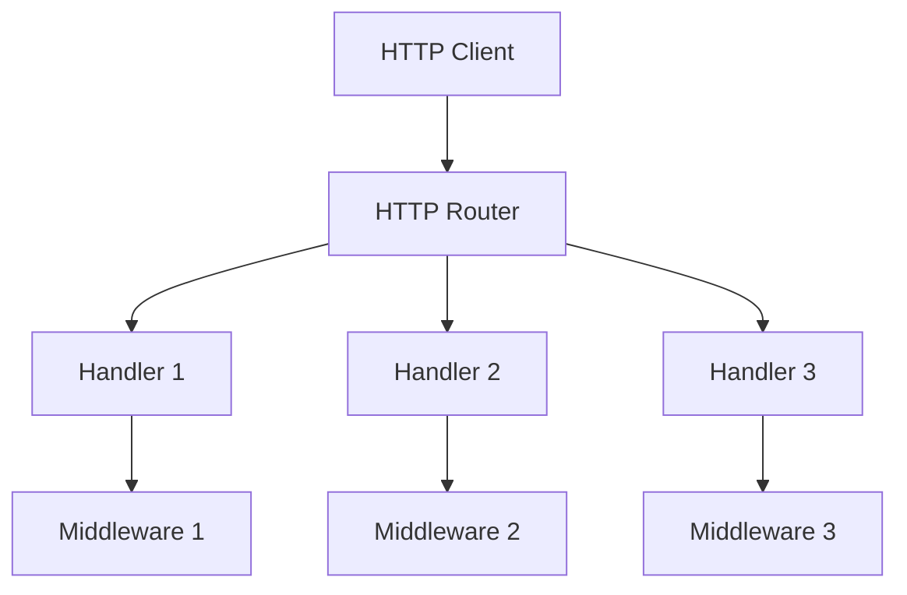

# Server Package

This package implements the HTTP server for the Solid server. It provides functionality for handling HTTP requests and responses.

## Design



## Key Components

- **Server**: HTTP server implementation
- **Router**: HTTP router implementation
- **Handler**: HTTP handler implementation
- **Middleware**: HTTP middleware implementation
- **Request**: HTTP request implementation
- **Response**: HTTP response implementation

## HTTP Methods

The package supports the following HTTP methods:

- **GET**: Retrieve a resource
- **POST**: Create a new resource
- **PUT**: Create or update a resource
- **PATCH**: Update a resource
- **DELETE**: Delete a resource
- **HEAD**: Get resource metadata
- **OPTIONS**: Get resource options

## Usage

```go
// Create a server
server := server.NewServer()

// Create a router
router := server.NewRouter()

// Register a handler
router.HandleFunc("/resource", func(w http.ResponseWriter, r *http.Request) {
    // Handle request
    w.Write([]byte("Hello, World!"))
})

// Register middleware
router.Use(func(next http.Handler) http.Handler {
    return http.HandlerFunc(func(w http.ResponseWriter, r *http.Request) {
        // Handle middleware
        next.ServeHTTP(w, r)
    })
})

// Start the server
err := server.Start(":8080")
if err != nil {
    // Handle error
    return
}
```

## Server Operations

The package supports the following server operations:

- **Start**: Start the server
- **Stop**: Stop the server
- **Shutdown**: Shutdown the server
- **ListenAndServe**: Listen and serve HTTP requests
- **ListenAndServeTLS**: Listen and serve HTTPS requests

## Router Operations

The package supports the following router operations:

- **HandleFunc**: Register a handler function
- **Handle**: Register a handler
- **Use**: Register middleware
- **Group**: Create a router group
- **Mount**: Mount a router at a path

## Handler Operations

The package supports the following handler operations:

- **ServeHTTP**: Serve an HTTP request
- **Handle**: Handle an HTTP request
- **HandleFunc**: Handle an HTTP request with a function

## Middleware Operations

The package supports the following middleware operations:

- **Use**: Register middleware
- **Wrap**: Wrap a handler with middleware
- **Chain**: Chain middleware together

## Error Handling

The package defines the following error types:

- **ErrServerClosed**: Server is closed
- **ErrServerStarted**: Server is already started
- **ErrServerStopped**: Server is already stopped
- **ErrInvalidHandler**: Invalid handler
- **ErrInvalidMiddleware**: Invalid middleware 