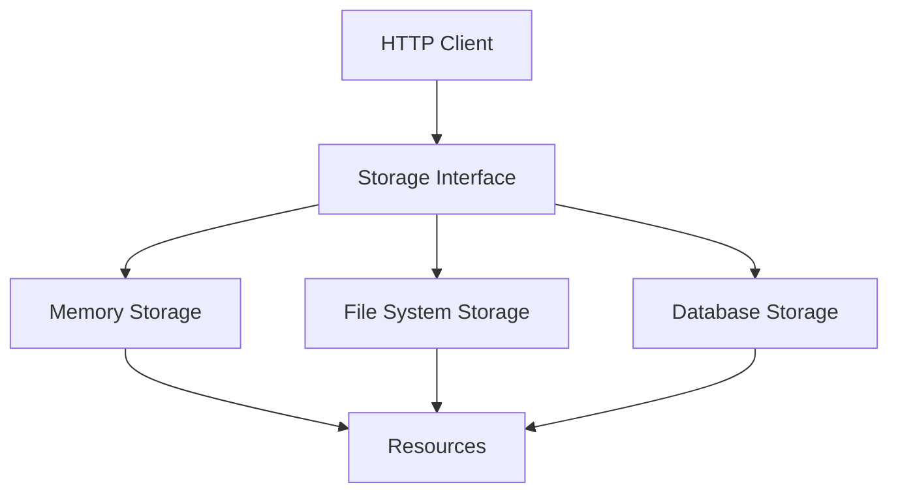

# Storage Package

This package provides a unified interface for storing and retrieving Solid resources. It supports multiple storage backends and provides a consistent API for resource management.

## Design



## Key Components

- **Storage**: Interface for storing and retrieving resources
- **MemoryStorage**: In-memory storage implementation
- **FileSystemStorage**: File system storage implementation
- **DatabaseStorage**: Database storage implementation
- **Resource**: Represents a Solid resource

## Storage Operations

The package supports the following storage operations:

- **Create**: Create a new resource
- **Read**: Read a resource
- **Update**: Update a resource
- **Delete**: Delete a resource
- **List**: List resources in a container
- **Exists**: Check if a resource exists
- **GetMetadata**: Get resource metadata
- **SetMetadata**: Set resource metadata

## Usage

```go
// Create a storage instance
storage := storage.NewMemoryStorage()

// Create a resource
resource := &storage.Resource{
    ID: "https://example.org/resource",
    Body: []byte("Hello, World!"),
    ContentType: "text/plain",
}
err := storage.Create(resource)
if err != nil {
    // Handle error
    return
}

// Read a resource
resource, err := storage.Read("https://example.org/resource")
if err != nil {
    // Handle error
    return
}

// Update a resource
resource.Body = []byte("Hello, Solid!")
err = storage.Update(resource)
if err != nil {
    // Handle error
    return
}

// Delete a resource
err = storage.Delete("https://example.org/resource")
if err != nil {
    // Handle error
    return
}
```

## Storage Backends

The package supports the following storage backends:

- **Memory**: In-memory storage for testing and development
- **File System**: File system storage for production use
- **Database**: Database storage for production use

## Resource Metadata

The package supports the following resource metadata:

- **ID**: Resource identifier
- **ContentType**: Resource content type
- **Created**: Resource creation time
- **Modified**: Resource modification time
- **Size**: Resource size in bytes
- **ETag**: Resource ETag
- **ACL**: Resource access control list

## Error Handling

The package defines the following error types:

- **ErrNotFound**: Resource not found
- **ErrExists**: Resource already exists
- **ErrInvalid**: Invalid resource
- **ErrPermission**: Permission denied
- **ErrStorage**: Storage error 